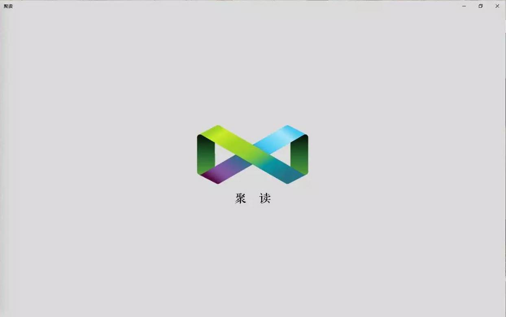
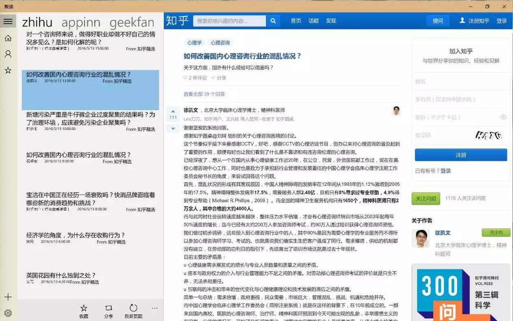
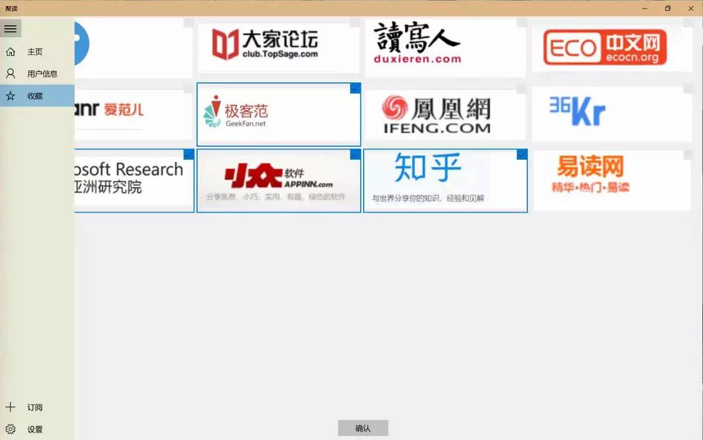
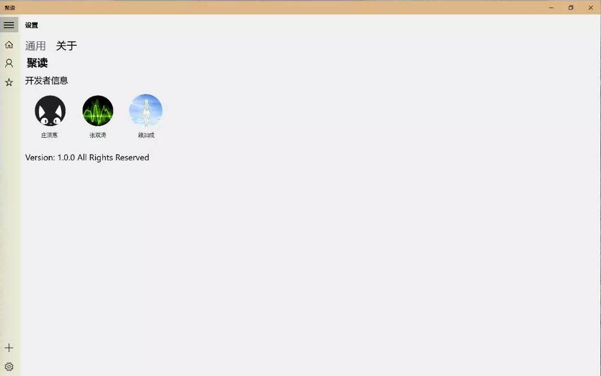

# judu
A RSS reader

## Screenshot

## Feature
---
1. 动态磁帖
>   动态磁贴显示类似ListItem的那些数据
>   1. 标题
>   2. 日期: 月/日
>   3. 摘要

2. 分享功能
>   分享的数据是ListItem

3. 侧边菜单栏
  - 首页
  - 各个消息源
  - 设置
  
4. 响应式UI
5. 注册登录
6. 保存数据（服务端+客户端)
7. 程序性修改消息源
8. 夜间模式及“关于我们”
9. Logo设计

    
## Server side API
---
1. overview(ListItem)
>   http://localhost:3000/overview?type=zhihu

  - Return Type: JSON Array
  - Item format:
        'title': '问题标题',
        'author': '作者名字',
        'description': '正文的前10个字',
        'date': '发布时间',
        'guid': '原文链接'

2. Specific Item(Detail)
>   http://localhost:3000/?type=zhihu&&id=1
    
    - id: 编号，如果超出范围，返回404
    - Return Type: HTML

## Server Setup
---
1. Download and install nodejs v6.0.0 from https://nodejs.org/en/
2. Under the directory 'server', run
    - npm install
    - npm start

## Available feed source
---
1. adaymag   译言精选
2. geekfan   极客范
3. scipark   科技公园
4. appinn    小众软件
5. ifanr     爱范儿
6. yidu      壹读
7. dajia     大家
8. ifeng     凤凰网
9. zhihu     知乎每日精选
10. duxieren 读写人
11. kr36     36氪
12. ecocn    经济学人中国
13. msa      微软研究院
14. engadget 
